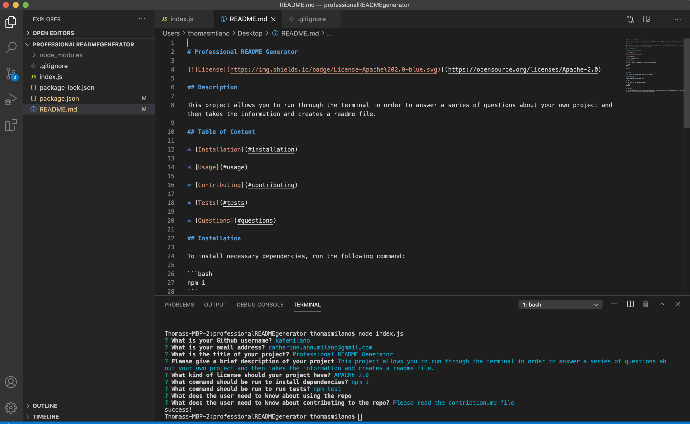
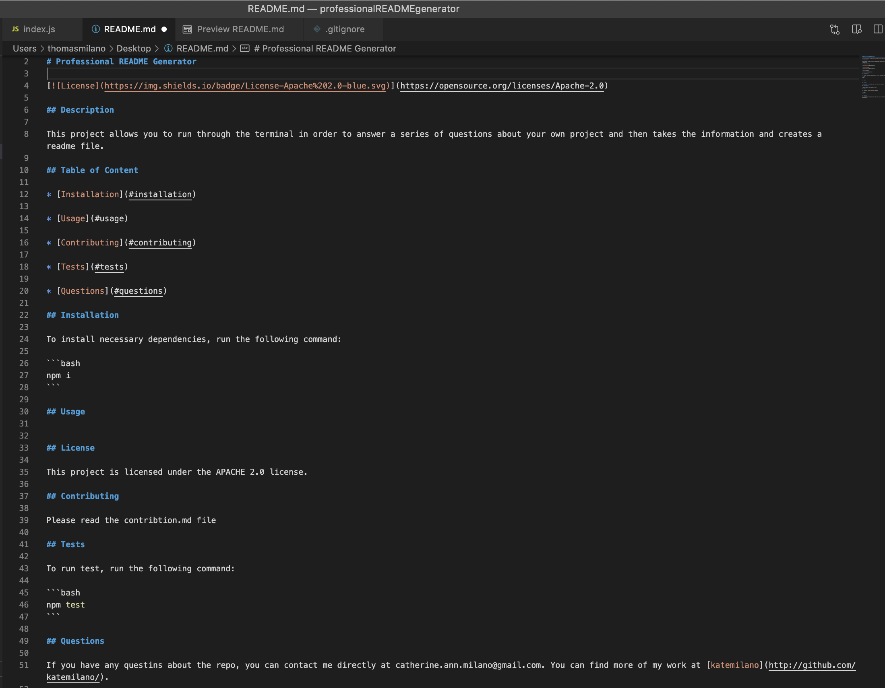
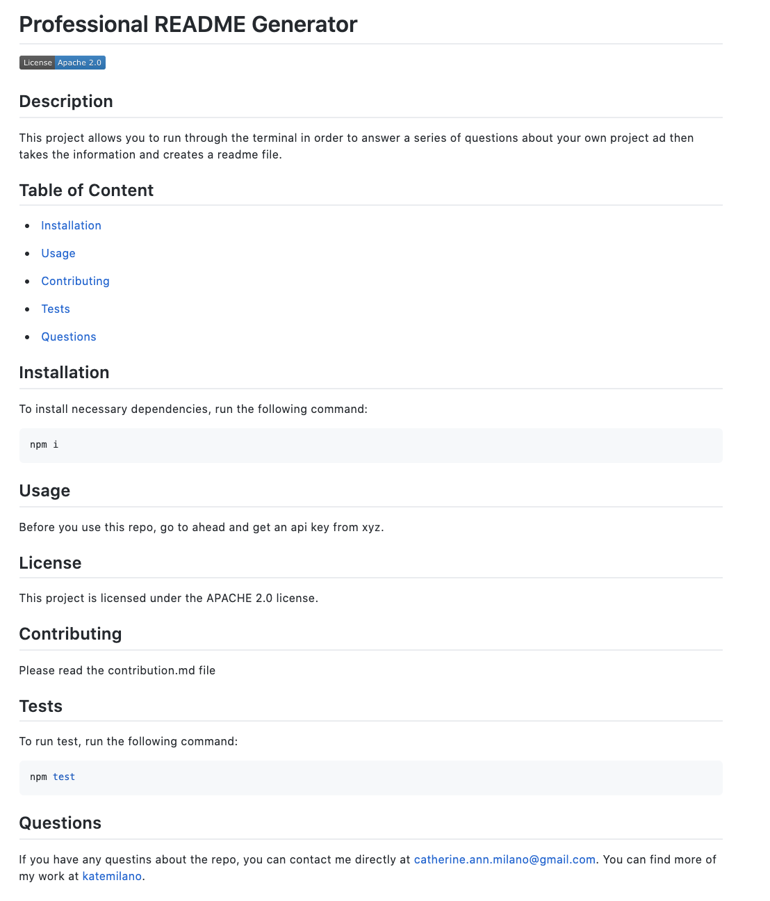

# Professional README Generator

[](https://opensource.org/licenses/Apache-2.0)

## Description

This project allows you to run through the terminal in order to answer a series of questions about your own project and then takes the information and creates a readme file.

## Table of Content

* [Photos](#photos)

* [Video](#video)

* [Installation](#installation)

* [Questions](#questions)

## Photos
Running through the terminal questions


What the README file should look like in VS Code


What the README file should look like in Github


## Video
This video demonstrates how to walk through the application and what it will look like when you are running it.
https://drive.google.com/file/d/1yFiaEE4g2Iis9qEl1yrS8IzFtLL90s_D/view

## Installation

To install necessary dependencies, run the following command:

```bash
npm i
```

## License

This project is licensed under the APACHE 2.0 license.

## Questions

If you have any questins about the repo, you can contact me directly at catherine.ann.milano@gmail.com. You can find more of my work at [katemilano](http://github.com/katemilano/).
    

